# Appendix B. Technology Tables

This appendix contains the manual's quick-reference technology tables.

The original split Markdown lost the table bodies, but pages `241-252` of the PDF were re-rendered and OCR'd back into Markdown. The recovered tables below are therefore much more complete than the original appendix stub, but they are still OCR-derived and should be treated as a draft transcription rather than a perfect source of truth.

Where a page OCR'd poorly, the page image is linked directly above the recovered table so the original scan stays close at hand during future cleanup.

Use the following guide to interpret the units referenced by the original tables:

- If the category is a technology, such as `Energy`, the unit is in levels of technology successfully researched.
- If the category is weight or a mineral name, the unit is in kilotons (`kT`).
- `DP` or `Dmg` measure damage in points or percentage to a hull, people, or surface installations.
- `Range` is the number of squares on the battle board shown in the VCR.
- `Fuel #` indicates the percentage of standard fuel usage for that engine at the warp speed indicated by the number.
- `Ability` refers to different things for each type of technology. For a description of an ability, open the Technology Browser and view the page for that item.

## Table Index

The manual contents page lists the following Appendix B table groups:

- Armor: `B-2`
- Beam Weapons: `B-3`
- Bombs: `B-4`
- Electrical: `B-5`
- Engines: `B-6`
- Hulls: `B-7`
- Mechanical: `B-8`
- Mines: `B-8`
- Mining: `B-9`
- Orbital: `B-9`
- Planetary: `B-10`
- Scanners: `B-11`
- Shields: `B-11`
- Starbase Hulls: `B-12`
- Terraforming: `B-12`
- Torpedoes: `B-13`

## Recovered Tables

### Armor (`B-2`)

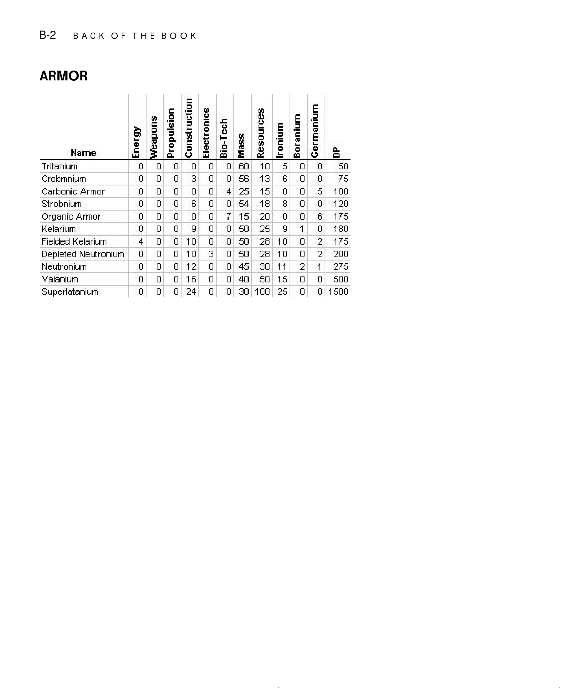

| Name | Energy| Weapons | Propulsion | Construction | Electronics | Bio-Tech | Mass | Resources | Ironium | Boranium | Germanium | DP  |
| Tritanium           | 0 | 0 | 0 |  0 | 0 | 0 | 60 |  10 |  5 | 0 | 0 |   50 |
| Crobmnium           | 0 | 0 | 0 |  3 | 0 | 0 | 56 |  13 |  6 | 0 | 0 |   75 |
| Carbonic Armor      | 0 | 0 | 0 |  0 | 0 | 4 | 25 |  15 |  0 | 0 | 5 |  100 |
| Strobnium           | 0 | 0 | 0 |  6 | 0 | 0 | 54 |  18 |  8 | 0 | 0 |  120 |
| Organic Armor       | 0 | 0 | 0 |  0 | 0 | 7 | 15 |  20 |  0 | 0 | 6 |  175 |
| Kelariurn           | 0 | 0 | 0 |  9 | 0 | 0 | 50 |  25 |  9 | 1 | 0 |  180 |
| Fielded Kelariurm   | 4 | 0 | 0 | 10 | 0 | 0 | 50 |  28 | 10 | 0 | 2 |  175 |
| Depleted Neutronium | 0 | 0 | 0 | 10 | 3 | 0 | 50 |  28 | 10 | 0 | 2 |  200 |
| Neutroniurn         | 0 | 0 | 0 | 12 | 0 | 0 | 45 |  30 | 11 | 2 | 1 |  275 |
| Valanium            | 0 | 0 | 0 | 16 | 0 | 0 | 40 |  50 | 15 | 0 | 0 |  500 |
| Superlataniun       | 0 | 0 | 0 | 24 | 0 | 0 | 30 | 100 | 25 | 0 | 0 | 1500 |

### Beam Weapons (`B-3`)

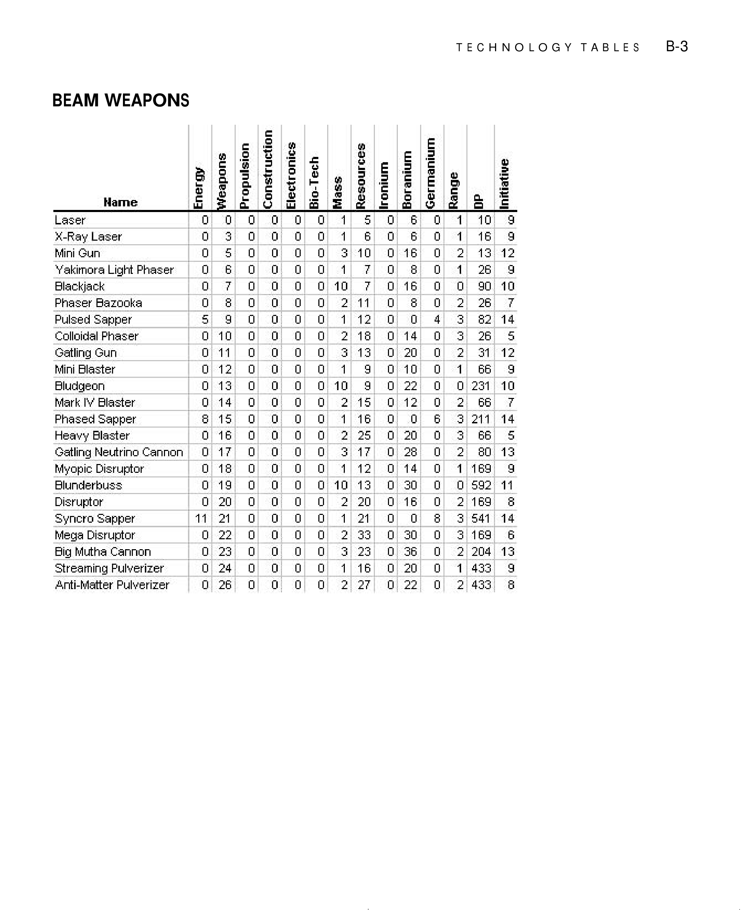

| Name | Energy| Weapons | Propulsion | Construction | Electronics | Bio-Tech | Mass | Resources | Ironium | Boranium | Germanium | Range | DP |
| Laser                   |  0 |  0 |  0 |  0 |  0 |  0 |  1 |  5 |  0 |  6 |  0 | 1 | 10 | 9 |
| X-Ray Laser             |  0 |  3 |  0 |  0 |  0 | 0  |  1 |  6 |  0 |  6 |  0 | 1 | 16 | 9 |
| Mini Gun                |  0 5 | 0 0 | 0 0 | 3 10 | 0 16 | 0 2 | 13 | 12 |   |
| Yakinora Light Phaser   |   | 0 6 | 0 0 | 0 0 | 1 7 | 0 8 | 0 1 | 26 | 9 |   |
| Blackjack               |   | 0 7 | 0 0 | 0 0 | 10 7 | 0 16 | 0 0 | 90 | 10 |   |
| Phaser Bazooka          |   | 0 8 | 0 0 | 0 0 | 2 11 | 0 8 | 0 2 | 26 | 7 |   |
| Pulsed Sapper           |   | 5 9 | 0 0 | 0 0 | 1 12 | 0 0 |   | 82 | 14 |   |
| Colloidal Phaser        |   | 0 10 | 0 0 | 0 0 | 2 18 | 0 14 | 0 | 26 | 5 |   |
| Gatling Gun             |   | 0 11 | 0 0 | 0 0 | 3 13 | 0 20 | 0 2 | 31 | 12 |   |
| Mini Blaster            |   | 0 12 | 0 0 | 0 0 | 1 9 | 0 10 | 0 1 | 66 | 9 |   |
| Bludgeon                |   | 口 13 | 0 0 | 0 0 | 10 9 | 0 22 | 0 0 | 231 | 10 |   |
| Mark IVBlaster          |   | 0 14 | 0 0 | 0 口 | 2 15 | 0 12 | 0 2 | 66 | 7 |   |
| Phased Sapper           |   | 8 15 | 0 0 | 0 0 | 1 16 | 0 0 | 6 3 | 211 | 14 |   |
| Heavy Blaster           |   | 0 16 | 0 0 | 0 0 | 2 25 | 0 20 | 0 | 66 | 5 |   |
| Gatling Neutrino Cannon |   | 0 17 | 0 0 | 0 0 | 3 17 | 0 28 | 0 2 | 80 | 13 |   |
| Myopic Disruptor |   | 0 18 | 0 0 | 0 0 | 1 12 | 0 14 | 0 1 | 169 | 6 |   |
| Blunderbuss |   | 0 19 | 0 0 | 0 0 | 10 13 | 0 30 | 0 0 | 592 | 11 |   |
| Disruptor |   | 0 20 | 0 0 | 0 0 | 2 20 | 0 16 | 0 2 | 169 | 8 |   |
| Syncro Sapper |   | 11 21 | 0 0 | 0 0 | 1 21 | 0 0 | 8 | 541 | 14 |   |
| Mega Disruptor |   | 0 22 | 0 0 | 0 0 | 2 | 0 | 0 | 169 | 6 |   |
| Big Mutha Cannon |   | 0 23 | 0 0 | 0 0 | 23 | 0 99 | 0 2 | 204 | 13 |   |
| StreamingPulverizer |   | 0 | 0 0 | 0 0 | 1 16 | 0 20 | 0 1 |   | 6 |   |
| Anti-Matter Pulverizer |   | 0 26 | 0 0 | 0 0 | 2 27 | 0 22 | 0 2 |   | 8 |   |

### Bombs (`B-4`)

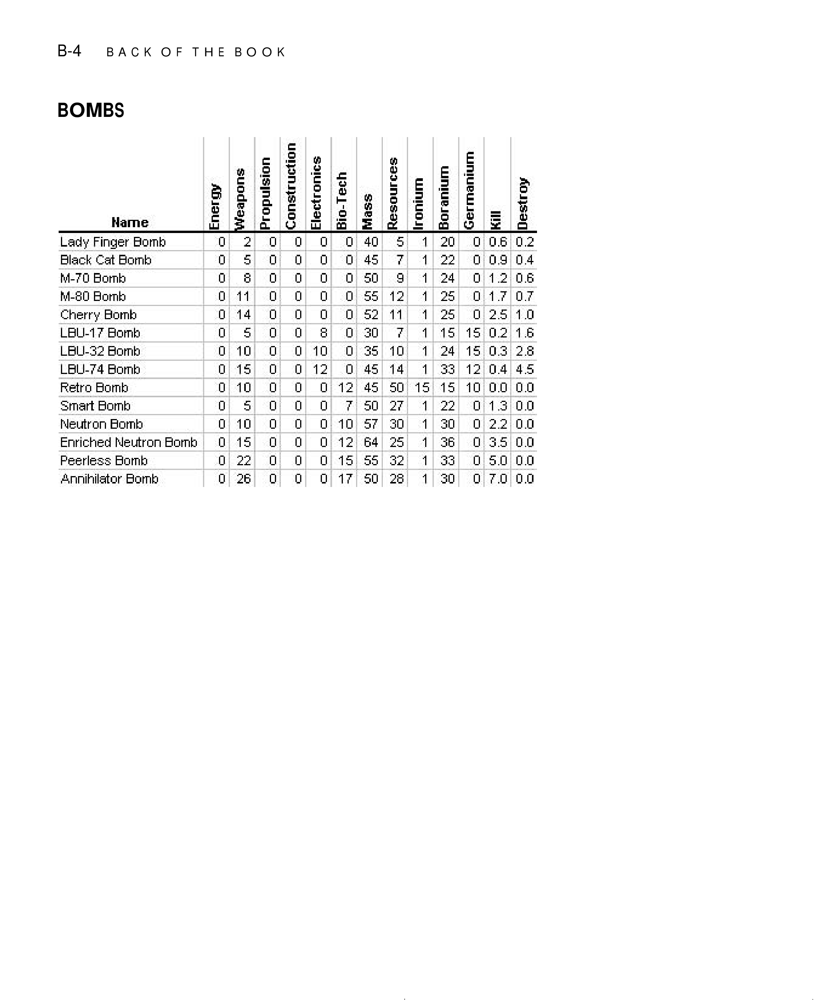

| B-4 | BACKOFTHEBOOK |   |   |   |   |   |   |   |   |
| --- | --- | --- | --- | --- | --- | --- | --- | --- | --- |
| BOMBS |   |   |   |   |   |   |   |   |   |
|   |   | Weapons | Propulsion Construction | Electronics | Bio-Tech | Resources | ironium Boranium | Germanium |   |
|   |   |   |   |   | Mass |   |   |   |   |
|   | Hame |   |   |   |   |   |   |   |   |
| Lady Finger Bomb |   | 0 2 | 0 | 0 0 | 0 40 | 5 | 1 20 | 0 0.6 | 0.2 |
| BlackCat Bomb |   | 0 | 0 | 0 0 | 0 45 | 7 | 1 22 | 0 0.9 | 0.4 |
| M-70 Bomb |   | 0 8 | 0 | 0 0 | 0 50 | 9 | 1 | 0 1.2 | 0.6 |
| M-80 Bormb |   | 0 11 | 0 | 0 0 | 0 55 | 12 | 1 25 | 0 1.7 | 0.7 |
| Cherry Bornb |   | 0 14 | 0 | 0 | 0 52 | 11 | 1 25 | 0 2.5 | 1.0 |
| LBU-17Bomb |   | 0 5 | 0 | 0 8 | 0 30 | 7 | 1 15 | 15 0.2 | 1.6 |
| LBU-32Bomb |   | 0 10 | 0 | 0 10 | 0 | 10 | 1 | 15 8'0 | 2.8 |
| LBU-74Bomb |   | 0 15 | 0 | 0 12 | 0 45 | 14 | 1 | 12 t'0 |   |
| Retro Bomb |   | 0 10 | 0 | 0 0 | 12 | 50 | 15 15 | 10 0.0 | 0.0 |
|   |   | 0 5 | 0 | 0 0 | 7 50 | 27 | 1 22 | 0 1.3 | 0.0 |
| Neutron Bomb |   | 0 10 | 0 | 0 0 | 10 57 | 30 | 1 | 0 2.2 | 0.0 |
| Enriched NeutronBomb |   | 0 15 | 0 | 0 0 | 12 9 | 25 | 1 99 | 0 3.50.0 |   |
| Peerless Bomb |   | 0 22 | 0 | 0 0 | 15 55 | 32 | 1 | 0 5.0 | 0.0 |
| Annihilator Bomb |   | 26 | 0 | 0 | 17 50 | 28 | 1 06 | 0 7.0 | 0.0 |

### Electrical (`B-5`)

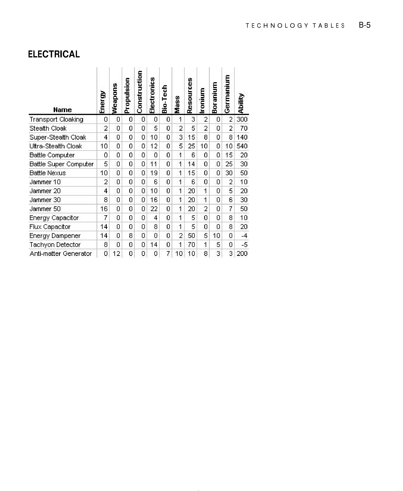

|   |   |   |   |   |   |   |   |   | TECHNOLOGYTABLES | B-5 |
| --- | --- | --- | --- | --- | --- | --- | --- | --- | --- | --- |
| ELECTRICAL |   |   |   |   |   |   |   |   |   |   |
|   |   | weapons | Propulsion | Construction Electronics | Bio-Tech | Resources Ironium | Boranium | Germanium |   |   |
|   |   |   |   |   |   |   |   | Ability |   |   |
|   | Hame |   |   |   |   |   |   |   |   |   |
| Transport Cloaking |   | 0 | 0 0 | 0 0 | 0 1 | 3 | 2 0 | 2 000 |   |   |
| Stealth Cloak |   | 2 | 0 0 | 0 5 | 0 2 | 5 | 2 0 | 2 | 70 |   |
| Super-Stealth Cloak |   |   | 0 0 | 0 10 | 0 | 15 | 8 | 8 140 |   |   |
| Ultra-Stealth Cloak |   | 10 | 0 0 | 0 12 | 0 5 | 25 | 10 | 10 540 |   |   |
| Battle Computer |   | 0 | 0 0 | 0 0 | 0 1 | 6 | 0 0 | 15 | 20 |   |
| Battle Super Computer |   | 5 | 0 0 | 0 11 | 0 1 | 14 | 0 0 | 25 | 30 |   |
| Battle Nexus |   | 10 | 0 0 | 0 19 | 0 1 | 15 | 0 0 | 30 | 50 |   |
| Jarmrmer 10 |   | 2 | 0 | 0 6 | 0 1 | 6 | 0 0 | 2 | 10 |   |
| Jarmrmer 20 |   |   | 0 0 | 0 10 | 0 1 | 20 | 1 0 | 5 | 20 |   |
| Jarmrmer30 |   | 8 | 0 0 | 0 16 | 0 1 | 20 | 1 0 | 6 |   |   |
|   |   | 16 | 0 0 | 0 22 | 0 1 | 20 | 2 0 | 7 | 50 |   |
| Energy Capacitor |   | 7 | 0 0 | 0 | 0 1 | 5 | 0 0 | 8 | 10 |   |
| Flux Capacitor |   | 14 | 0 0 | 0 8 | 0 1 | 5 | 0 0 | 8 | 20 |   |
| Energy Dampener |   | 14 | 0 8 | 0 0 | 0 2 | 50 | 5 10 | 0 |   |   |
| Tachyon Detector |   | 8 | 0 0 | 0 14 | 0 1 | 70 | 1 5 | 0 | -5 |   |
| Anti-matter Generator |   | 0 12 | 0 | 0 0 | 7 10 | 10 | 8 | 200 |   |   |

### Engines (`B-6`)

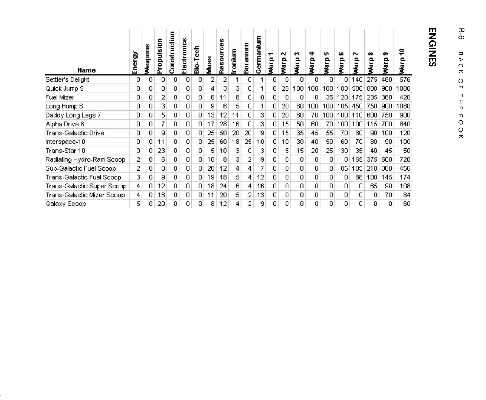

This page OCR'd much more poorly than the other appendix pages. The raw recovered text is included below so the engine names and fuel columns are not lost, but this section still needs manual reconstruction from the scan.

```text
| warp10 | 0 | 006 | 100 品 720 | 456 174 108 | 8 |
| --- | --- | --- | --- | --- | --- |
| B-6 BACKOFTHEBOOK |   |   |   |   |   |
| ENGINES |   |   |   |   |   |
| warp9 | 090 | 0000 | 100 06 45 | 080 8 | P 口 |
| warp8 | 275480 1805008009001080 235 | 1054507509001080 115 | 06 08 375600 | 210 100145 8 | 口 口 |
| Warp7 | 0140 175 | 100110600750 100 | 70 35 165 | 105 88 口 | 口 |
| warp6 | 120 | 001 | P 8 3 | 8 口 | 口 口 |
| warp5 | 口 100 | 100 100 P | 品 |   |   |
| warp4 | 口 100 | 100 70 09 |   |   |   |
| warp3 | 口 100 | 8 8 OS | 00 |   |   |
| Warp2 | 口 25 口 | 8 2 |   |   |   |
| warp1 |   |   |   |   | 口 |
| Germanium |   | 3 |   | 2 | 6 |
| Boranium | 口 | 口 | 口 2 | 寸 寸 寸 | 2 2 |
| wnluoJ | m | 1 1 | 1 | 寸 | 寸 |
| Resources | 2 3 1 | 6 2 | 8 10 | 2 18 忆 | 2 |
|   | 2 寸 |   | 10 | 19 18 |   |
| Tech Bio- |   |   |   |   | 口 D |
| Electr | 0 |   |   |   | 口 |
| Construction | 口 口 |   |   |   | 口 口 |
| Propulsion | 2 |   | 11 8 6 | 00 2 | 1 |
| Weapons |   |   |   |   |   |
| Energy |   |   |   |   |   |
|   | Name |   | Radiating Hydro-Ram Scoop | Sub-GalacticFuel Scoop Trans-GalacticFuel Scoop Trans-GalacticSuperScoop | Trans-Galactic Mizer Scoop |
|   |   | Daddy Long Legs7 | Trans-GalacticDrive |   |   |
|   | Settler's Delight QuickJump5 FuelMizer | LongHump6 Alpha Drive8 | Interspace-10 Trans-Star10 |   | Galaxy Scoop |
```

### Hulls (`B-7`)

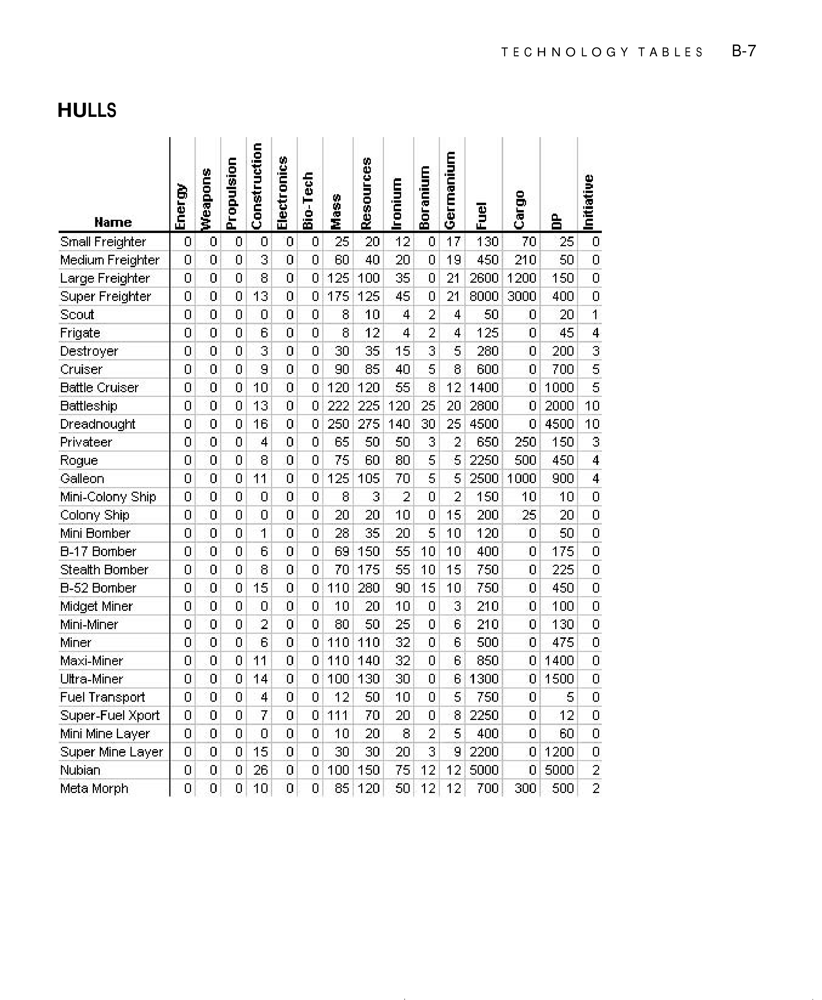

|   |   |   |   |   |   |   |   | TECHNOLOGYTABLES |   |   |   | B-7 |
| --- | --- | --- | --- | --- | --- | --- | --- | --- | --- | --- | --- | --- |
| HULLS |   |   |   |   |   |   |   |   |   |   |   |   |
|   |   | weapons | Propulsion Construction | Electronics | Resources | Ironium Boranium | Germanium |   |   |   | Initiative |   |
|   | Hame |   |   |   | E |   |   |   |   |   |   |   |
| Small Freighter |   | 0 0 | 0 0 | 0 0 | 25 20 | 12 | 0 17 | 130 | 70 | 25 | 0 |   |
| MecliurmFreighter |   | 0 0 | 0 3 | 0 0 | 60 40 | 20 | 0 19 | 450 | 210 | 50 | 0 |   |
| Large Freighter |   | 0 0 | 0 8 | 0 0 | 125 100 | 58 | 0 21 | 2600 | 1200 | 150 | 0 |   |
| Super Freighter |   | 0 0 | 0 13 | 0 0 | 175 125 | St | 0 21 | 8000 | 3000 | 00t | 0 |   |
| Scout |   | 0 0 | 0 0 | 0 0 | 8 10 |   | 2 | 50 | 0 | 20 | 1 |   |
| Frigate |   | 0 0 | 0 6 | 0 0 | 8 12 |   | 2 | 125 | 0 | 45 |   |   |
| Destroyer |   | 0 0 | 0 3 | 0 0 | 30 | 15 | 5 | 280 | 0 | 200 |   |   |
| Cruiser |   | 0 0 | 0 6 | 0 0 | 90 58 | 40 | 5 8 | 600 | 0 | 700 | 5 |   |
| Battle Cruiser |   | 0 0 | 0 10 | 0 0 | 120 120 | 55 | 8 12 | 1400 | 0 1000 |   | 5 |   |
| Battleship |   | 0 0 | 0 13 | 0 0 | 222 225 | 120 | 25 20 | 2800 | 0 2000 |   | 10 |   |
| Dreadnought |   | 0 0 | 0 16 | 0 0 | 250 275 | 140 | 00 25 |   | 0 4500 |   | 10 |   |
| Privateer |   | 0 0 | 0 | 0 0 | 65 50 | 50 | 2 | 650 | 250 | 150 |   |   |
| Rogue |   | 0 0 | 0 8 | 0 0 | 75 60 | 80 | 5 5 | 2250 | 500 | 450 |   |   |
| Galleon |   | 0 0 | 0 11 | 0 0 | 125 105 | 70 | 5 5 | 2500 | 1000 | 900 |   |   |
| Mini-Colony Ship |   | 0 0 | 0 0 | 0 0 | 8 E | 2 | 0 2 | 150 | 10 | 10 | 0 |   |
| Colony Ship |   | 0 0 | 0 0 | 0 0 | 20 20 | 10 | 0 15 | 200 | 25 | 20 | 0 |   |
| Mini Bomber |   | 0 0 | 0 1 | 0 0 | 28 | 20 | 5 10 | 120 | 0 | 50 | 0 |   |
| B-17Bomber |   | 0 0 | 0 6 | 0 0 | 69 150 | 55 | 10 10 | 400 | 0 | 175 | 0 |   |
| StealthBormber |   | 0 0 | 0 8 | 0 0 | 70 175 | 55 | 10 15 | 750 | 0 | 225 | 0 |   |
| B-52Bomber |   | 0 0 | 0 15 | 0 0 | 110 280 | 90 15 | 10 | 750 | 0 | 450 | 0 |   |
| Midget Miner |   | 0 0 | 0 0 | 0 0 | 10 20 | 10 | 0 | 210 | 0 | 100 | 0 |   |
| Mini-Miner |   | 0 0 | 0 2 | 0 0 | 80 50 | 25 | 0 6 | 210 | 0 | 130 | 0 |   |
| Miner |   | 0 0 | 0 6 | 0 0 | 110 110 | 32 | 0 6 | 500 | 0 | 475 | 0 |   |
| Maxi-Miner |   | 0 0 | 0 11 | 0 0 | 110 140 | 32 | 0 6 | 850 | 0 1400 |   | 0 |   |
| Ultra-Miner |   | 0 0 | 0 14 | 0 0 | 100 130 | 30 | 0 6 | 1300 | 0 1500 |   | 0 |   |
| Fuel Transport |   | 0 0 | 0 | 0 0 | 12 50 | 10 | 0 5 | 750 | 0 | 5 | 0 |   |
| Super-FuelXport |   | 0 0 | 0 7 | 0 0 | 111 70 | 20 | 0 8 | 2250 | 0 | 12 | 0 |   |
| Mini Mine Layer |   | 0 0 | 0 0 | 0 0 | 10 20 | 8 | 2 5 | 400 | 0 | 60 | 0 |   |
| SuperMineLayer |   | 0 0 | 0 15 | 0 0 | 30 30 | 20 | 9 | 2200 | 0 1200 |   | 0 |   |
| Nubian |   | 0 0 | 0 26 | 0 0 | 100 150 | 75 | 12 12 | 5000 | 0 5000 |   | 2 |   |
| Meta Morph |   | 0 0 | 0 10 | 0 0 | 85 120 | 50 | 12 12 | 700 | 000 | 500 | 2 |   |

### Mechanical (`B-8`)

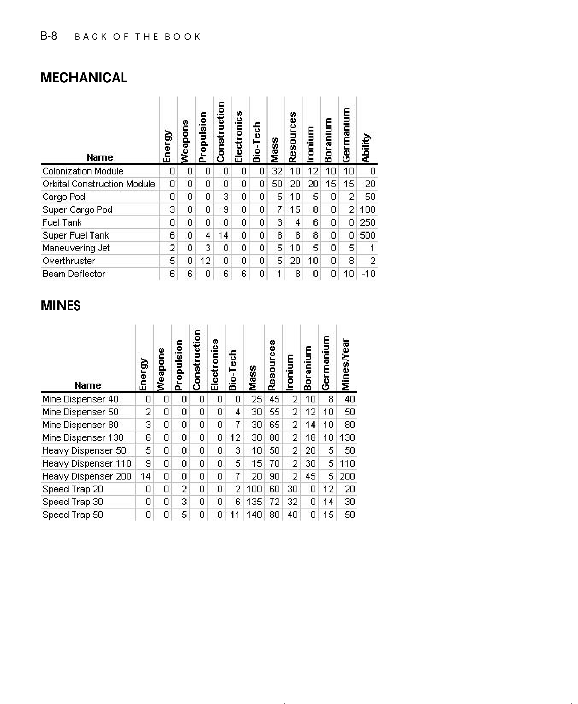

| B-8 | BACKOFTHEBOOK |   |   |   |   |   |   |   |
| --- | --- | --- | --- | --- | --- | --- | --- | --- |
| MECHANICAL |   |   |   |   |   |   |   |   |
|   |   |   | Weapons Propulsion | Construction Electronics | Bio-Tech | Resources Ironium | Boranium Germanium |   |
|   |   |   |   |   | Mass |   |   | Ability |
|   | Hame |   |   |   |   |   |   |   |
| Colonization Module |   | 0 | 0 0 | 0 0 | 0 | 10 12 | 10 10 |   |
| Orbital Construction Module |   | 0 | 0 0 | 0 0 | 0 50 | 20 20 | 15 15 | 20 |
| Cargo Pod |   | 0 | 0 0 | 3 0 | 0 5 | 10 5 | 0 | 2 50 |
| Super Cargo Pod |   |   | 0 0 | 6 0 | 0 7 | 15 8 | 0 | 2 100 |
| Fuel Tank |   | 0 | 0 0 | 0 0 | 0 3 | 6 |   | 250 |
| Super Fuel Tank |   | 6 | 0 | 14 0 | 0 8 | 8 8 | 0 | 0 500 |
| Maneuvering Jet |   | 2 | 0 | 0 0 | 0 5 | 10 5 | 0 | 1 |
| Overthruster |   | 5 | 0 12 | 0 0 | 0 | 20 10 | 0 | 2 |
| Beam Deflector |   | 6 | 6 0 | 6 6 | 0 1 | 8 0 | 0 10 | -10 |

### Mines (`B-8`)


|   |   | Weapons Propulsion | Construction Electronics | Bio-Tech | Resources | Ironium Boranium | Germanium Mines/Year |   |
| --- | --- | --- | --- | --- | --- | --- | --- | --- |
| MINES |   |   |   |   |   |   |   |   |
|   | Hame |   |   |   |   |   |   |   |
| Mine Dispenser 40 |   | 口 0 | 0 0 | 0 0 | 25 45 | 2 10 | 8 |   |
| Mine Dispenser 50 |   | 2 0 | 0 0 | 0 十 | 55 | 2 12 | 10 50 |   |
| Mine Dispenser80 |   | 0 | 0 0 | 0 7 | 30 65 | 2 14 | 10 08 |   |
| Mine Dispenser 130 |   | 6 0 | 0 0 | 0 12 | 30 80 | 2 18 | 10 130 |   |
| Heavy Dispenser 50 |   | 5 0 | 0 0 | 0 | 10 50 | 2 20 | 5 50 |   |
| HeavyDispenser 110 |   | 9 0 | 0 0 | 0 5 | 15 70 | 2 | 5 110 |   |
| Heavy Dispenser 200 |   | 14 0 | 0 0 | 0 7 | 20 90 | 2 45 | 5 200 |   |
| Speed Trap 20 |   | 0 0 | 2 0 | 0 2 | 100 60 | 30 0 | 12 20 |   |
| Speed Trap 30 |   | 0 0 | 3 0 | 0 6 | 135 72 | 32 0 | 14 |   |
| Speed Trap 50 |   | 0 0 | 5 0 | 0 11 | 140 08 | 40 0 | 15 50 |   |

### Mining and Orbital (`B-9`)

The manual contents page lists `Mining` and `Orbital` on page `B-9`, but the OCR recovery from pages `241-252` did not yield a distinct `B-9` page body. Keep the original PDF close for these two table groups until they can be reconstructed manually.

### Planetary (`B-10`)

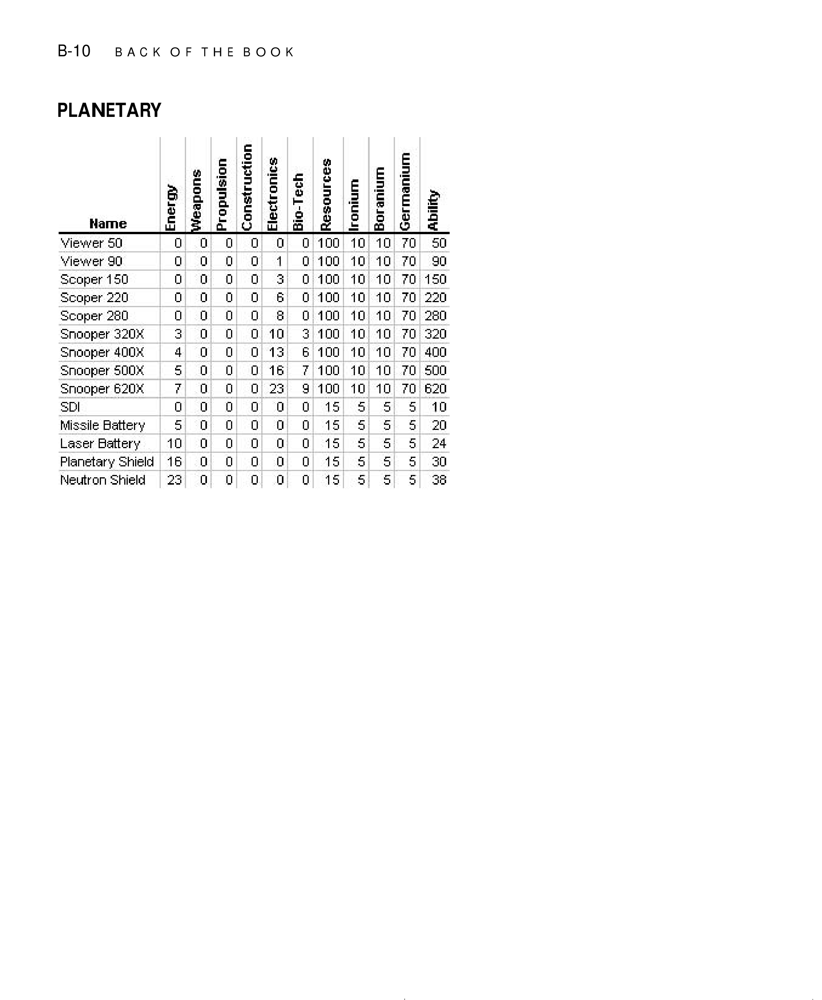

The first two scanner names on this page did not OCR cleanly, but the remaining rows are preserved below.

| B-10 |   | BACKOFTHEBOOK |   |   |   |   |   |   |
| --- | --- | --- | --- | --- | --- | --- | --- | --- |
| PLANETARY |   |   |   |   |   |   |   |   |
|   |   |   | Weapons | Propulsion Construction | Electronics Bio-Tech | Resources | lronium Boranium | Germanium |
|   |   |   |   |   |   |   |   | Ability |
|   | Hame |   |   |   |   |   |   |   |
|   |   |   | 0 0 | 口 0 | 0 | 0 100 | 10 10 | 70 50 |
|   |   |   | 0 0 | 0 0 | 1 | 0 100 | 10 10 | 70 90 |
| Scoper150 |   |   | 0 0 | 0 0 | 3 | 0 100 | 10 10 | 70 150 |
| Scoper 220 |   |   | 0 0 | 0 0 | 6 | 0 100 | 10 10 | 70 220 |
| Scoper 280 |   |   | 0 0 | 0 0 | 8 | 0 100 | 10 10 | 70 280 |
| Snooper 320X |   |   | 0 | 0 0 | 10 | 100 | 10 10 | 70 320 |
|   |   |   | 0 | 0 0 | 13 | 6 100 | 10 10 | 70 400 |
| Snooper 500X |   |   | 5 0 | 0 0 | 16 | 7 100 | 10 10 | 70 500 |
| Snooper 620X |   |   | 7 0 | 0 0 | 23 | 9 100 | 10 10 | 70 620 |
| SDI |   |   | 0 0 | 0 0 | 0 | 0 15 | 5 5 | 5 10 |
| Missile Battery |   |   | 5 0 | 0 0 | 0 | 0 15 | 5 5 | 5 20 |
| LaserBattery |   |   | 10 0 | 0 0 | 0 | 0 15 | 5 5 | 5 |
| Planetary Shield |   |   | 16 0 | 0 0 | 0 | 0 15 | 5 5 | 5 |
| Neutron Shield |   |   | 23 0 | 0 0 | 0 | 0 15 | 5 5 | 5 88 |

### Scanners (`B-11`)

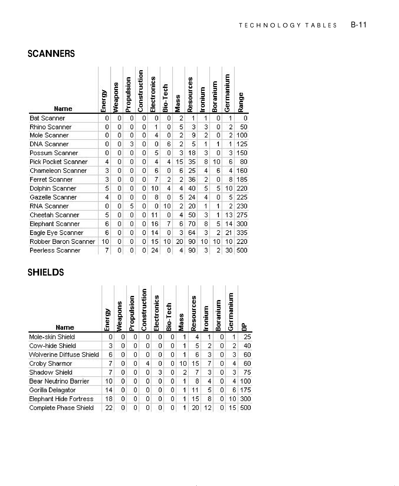

|   |   |   |   |   |   |   | TECHNOLOGYTABLES | B-11 |
| --- | --- | --- | --- | --- | --- | --- | --- | --- |
| SCANNERS |   |   |   |   |   |   |   |   |
|   |   | Weapons Propulsion | Construction | Electronics Bio-Tech | Resources | lronium Boranium | Germanium |   |
|   |   |   |   |   | Mass |   | Range |   |
|   | Hame |   |   |   |   |   |   |   |
| Bat Scanner |   | 0 0 | 0 0 | 0 0 | 2 1 | 1 0 | 1 0 |   |
| Rhino Scanner |   | 0 0 | 0 0 | 1 0 | 5 3 | 3 0 | 2 50 |   |
| Mole Scanner |   | 0 0 | 0 0 | 0 | 2 9 | 2 0 | 2 100 |   |
| DNA Scanner |   | 0 0 | 3 0 | 0 6 | 2 5 | 1 1 | 1 125 |   |
| Possum Scanner |   | 0 | 0 0 | 0 | E 18 | 3 0 | 3 150 |   |
| PickPocket Scanner |   | 0 | 0 0 |   | 15 | 8 10 | 6 80 |   |
| Chameleon Scanner |   | 3 0 | 0 0 | 6 0 | 6 25 | 6 | 160 |   |
| Ferret Scanner |   | 3 0 | 0 0 | 7 2 | 2 36 | 2 0 | 8 185 |   |
| Dolphin Scanner |   | 5 0 | 0 0 | 10 |   | 5 5 | 10 220 |   |
| Gazelle Scanner |   | 0 | 0 0 | 8 0 | 5 24 | 0 | 5 225 |   |
| RNA Scanner |   | 0 0 |   | 0 10 | 2 20 | 1 1 | 2 230 |   |
| Cheetah Scanner |   | 5 0 | 0 0 | 11 0 | 50 | 1 | 13 275 |   |
| Elephant Scanner |   | 6 0 | 0 0 | 16 7 | 6 70 | 8 5 | 14 008 |   |
| Eagle Eye Scanner |   | 6 0 | 0 0 | 14 0 | 64 | 2 | 21 |   |
| Robber Baron Scanner |   | 10 0 | 0 0 | 15 10 | 20 90 | 10 10 | 10 220 |   |
| Peerless Scanner |   | 7 0 | 0 0 | 忆 0 | 90 | 3 2 | 30 500 |   |

### Shields (`B-11`)


|   |   | weapons | Propulsion Construction | Electronics Bio-Tech | Resources | Ironium Boranium | Germanium |   |
| --- | --- | --- | --- | --- | --- | --- | --- | --- |
| SHIELDS |   |   |   |   |   |   |   |   |
|   |   |   |   |   | Mass |   |   |   |
|   | Hame |   |   |   |   |   |   |   |
| Mole-skin Shield |   | 0 0 | 0 0 | 0 0 | 1 | 1 0 | 1 25 |   |
| Covw-hide Shield |   | 0 | 0 0 | 0 0 | 1 5 | 2 0 | 2 40 |   |
| Wolverine Diffuse Shield |   | 6 0 | 0 0 | 0 0 | 1 6 | 3 0 | 3 60 |   |
| Croby Sharmor |   | 7 0 | 0 | 0 0 | 10 15 | 7 0 | 60 |   |
| Shadow Shield |   | 7 0 | 0 0 | 3 0 | 2 7 | 3 0 | 3 75 |   |
| BearNeutrinoBarrier |   | 10 0 | 0 0 | 0 0 | 1 8 | 0 | 100 |   |
| Gorilla Delagator |   | 14 0 | 0 0 | 0 0 | 1 11 | 5 0 | 6 175 |   |
| Elephant Hide Fortress |   | 18 0 | 0 0 | 0 0 | 1 15 | 8 0 | 10 300 |   |
| Complete Phase Shield |   | 22 0 | 0 0 | 0 口 | 1 20 | 12 0 | 15 500 |   |

### Starbase Hulls (`B-12`)

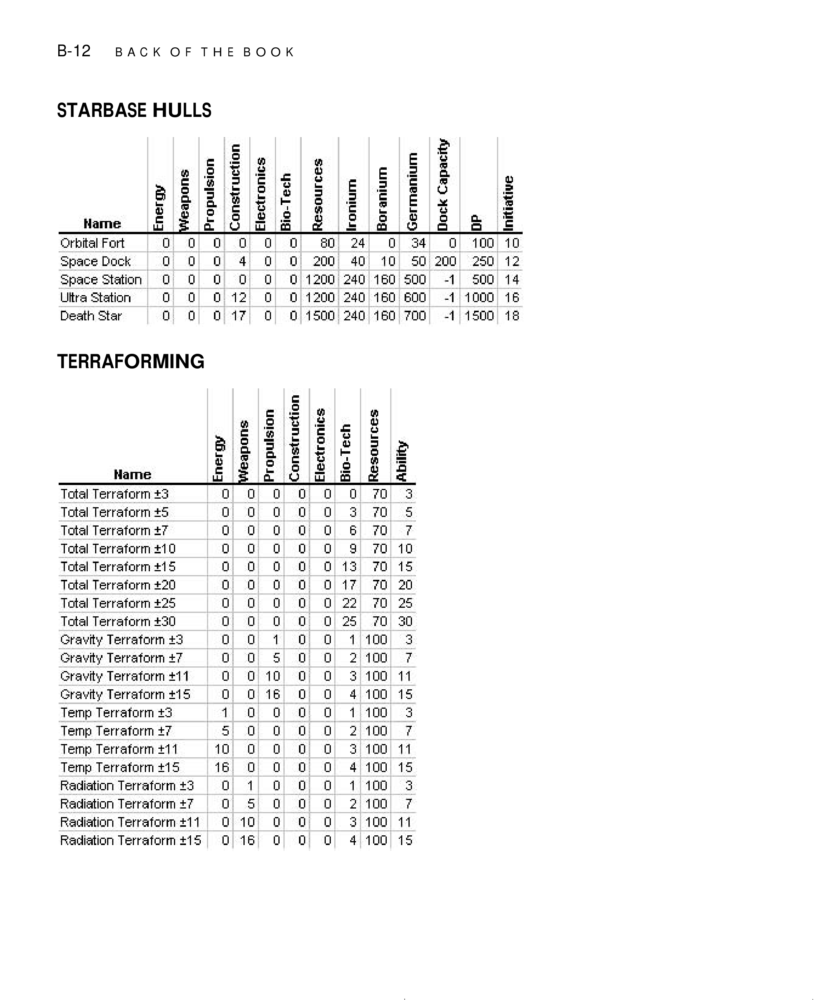

| B-12 | BACKOFTHEBOOK |   |   |   |   |   |   |   |   |
| --- | --- | --- | --- | --- | --- | --- | --- | --- | --- |
| STARBASE HULLS |   |   |   |   |   |   |   |   |   |
|   |   | Weapons Propulsion | Construction Electronics | Bio-Tech | Resources lronium | Boranium | Germanium | Dock Capacity | Initiative |
| Hame |   |   |   |   |   |   |   |   |   |
| Orbital Fort |   | 0 0 | 0 0 | 0 0 | 80 |   | 0 | 0 100 | 10 |
| Space Dock |   | 0 0 | 0 | 0 0 | 200 0 | 10 | 50 | 200 250 | 12 |
| Space Station |   | 0 0 | 0 0 | 0 0 1200 | 240 | 160 | 500 | -1 500 | 14 |
| Ultra Station |   | 0 0 | 0 12 | 0 0 1200 | 240 | 160 | 600 | -1 1000 | 16 |
| Death Star |   | 0 0 | 0 17 | 0 0 1500 | 0 | 160 | 700 | -1 1500 | 18 |

### Terraforming (`B-12`)


|   |   |   | weapons | Propulsion Construction | Electronics Bio-Tech | Resources |   |   |   |
| --- | --- | --- | --- | --- | --- | --- | --- | --- | --- |
| TERRAFORMING |   |   |   |   |   |   |   |   |   |
|   |   |   |   |   |   |   | Ability |   |   |
|   | Hame |   |   |   |   |   |   |   |   |
| Total Terraform ±3 |   |   | 口 0 | 0 0 | 0 0 | 70 | 3 |   |   |
| Total Terraform ±5 |   |   | 0 0 | 0 0 | 0 3 | 70 | 5 |   |   |
| Total Terraform±7 |   |   | 0 0 | 0 0 | 0 6 | 70 | 7 |   |   |
| Total Terraform ±10 |   |   | 0 0 | 0 0 | 0 9 | 70 | 10 |   |   |
| Total Terraform±15 |   |   | 0 0 | 0 0 | 0 13 | 70 | 15 |   |   |
| Total Terraform ±20 |   |   | 0 | 0 0 | 0 17 | 70 | 20 |   |   |
| Total Terraform±25 |   |   | 0 0 | 0 0 | 0 22 | 70 | 25 |   |   |
| Total Terraform ±30 |   |   | 0 0 | 0 0 | 0 25 | 70 | 30 |   |   |
| Gravity Terraforrn ±3 |   |   | 0 0 | 1 0 | 0 1 | 100 |   |   |   |
| Gravity Terraforrn ±7 |   |   | 0 0 | 5 0 | 0 2 | 100 | 7 |   |   |
| GravityTerraforrm ±11 |   |   | 0 0 | 10 0 | 0 3 | 100 | 11 |   |   |
| Gravity Terraforrn ±15 |   |   | 0 0 | 16 0 | 0 | 100 | 15 |   |   |
| Termp Terraform ±3 |   |   | 1 0 | 0 0 | 0 1 | 100 |   |   |   |
| Termp Terraform ±7 |   |   | 5 0 | 0 0 | 0 2 | 100 | 7 |   |   |
| Termp Terraform±11 |   |   | 10 0 | 0 0 | 0 3 | 100 | 11 |   |   |
| TermpTerraforrm±15 |   |   | 16 0 | 0 0 | 0 | 100 | 15 |   |   |
| Radiation Terraform ±3 |   |   | 0 1 | 0 0 | 0 1 | 100 | 3 |   |   |
| Radiation Terraform ±7 |   |   | 0 5 | 0 0 | 0 2 | 100 | 7 |   |   |
| Radiation Terraform±11 |   |   | 0 10 | 0 0 | 0 3 | 100 | 11 |   |   |
| Radiation Terraform ±15 |   |   | 0 16 | 0 0 | 0 | 100 | 15 |   |   |

### Torpedoes (`B-13`)

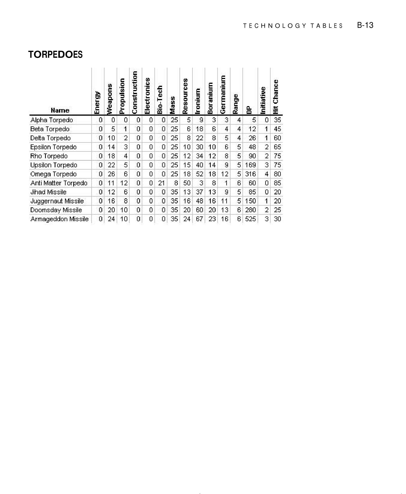

|   |   |   |   |   |   |   |   | TECHNOLOGYTABLES |   | B-13 |
| --- | --- | --- | --- | --- | --- | --- | --- | --- | --- | --- |
| TORPEDOES |   |   |   |   |   |   |   |   |   |   |
|   |   |   | Propulsion Construction | Electronics | Bio-Tech | Resources lronium | Boranium Germanium |   | Initiative Hit Chance |   |
|   |   | Aa |   |   |   |   |   | Range |   |   |
|   | Hame |   |   |   |   |   |   |   |   |   |
| Alpha Torpedo |   | 0 口 | 0 | 0 0 | 0 25 | 5 6 |   | 5 | 0 |   |
| Beta Torpedo |   | 0 5 | 1 | 0 0 | 0 25 | 6 18 | 6 | 12 | 1 45 |   |
| Delta Torpedo |   | 0 10 | 2 | 0 0 | 0 25 | 8 22 | 8 5 |   | 1 60 |   |
| Epsilon Torpedo |   | 0 14 | 3 | 0 0 | 0 25 | 10 30 | 10 6 | 5 8 | 2 65 |   |
| Rho Torpedo |   | 0 18 |   | 0 0 | 0 25 | 12 | 12 8 | 5 90 | 2 75 |   |
| Upsilon Torpedo |   | 0 22 | 5 | 0 0 | 0 25 | 15 40 | 14 9 | 5 169 | 75 |   |
| Omega Torpedo |   | 0 26 | 6 | 0 0 | 0 25 | 18 52 | 18 12 | 5 316 | 08 |   |
| Anti Matter Torpedo |   | 0 11 | 12 | 0 0 | 21 8 | 50 C | 8 1 | 6 60 | 0 98 |   |
| Jihad Missile |   | 0 12 | 6 | 0 0 | 0 35 | 13 37 | 13 9 | 5 85 | 0 20 |   |
| Juggernaut Missile |   | 0 16 | 8 | 0 0 | 0 35 | 16 48 | 16 11 | 5 150 | 1 20 |   |
| Doomsday Missile |   | 0 20 | 10 | 0 0 | 0 35 | 20 60 | 20 13 | 6 280 | 2 25 |   |
| Armageddon Missile |   | 0 | 10 | 口 | 0 | 67 | 16 | 6 525 |   |   |
